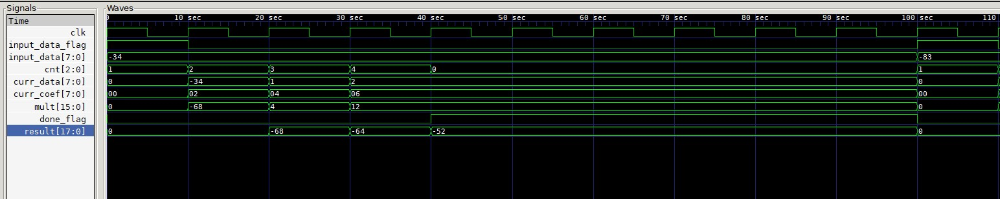

# FIR-filter

Домашнее задание №1 по курсу "Системотехника ЭВС"

Студент: Кутаев К.С.

Преподаватель: Орлов А.О.

# Задание

```
Реализовать КИХ фильтр, 3 отсчета, размерность 8 бит, знаковые числа. Вход поступает
каждые 10 тактов, размерность 8 бит, знаковые целые числа.
Допускается использовать один (два*) физический умножитель. Обосновать размерность
результата. К заданию представить бит-совместимую модель на любом языке программирования.
```

# Результаты

Первые 3 такта работы фильтра


Первые 5 тактов работы фильтра


# Модель на языке Python

Сравнение результатов работы фильтра на языке Verilog и Python. Представлены значения регистров в процессе работы 1 такта.

**Verilog**



**Python**

```
Cycle -> 0
input_data_flag -> True
input_data -> -34
CNT -> 1
CURR_DATA -> 0
CURR_COEF -> 0
mult -> 0
DONE_FLAG -> False
    RESULT -> 0

Cycle -> 1
input_data_flag -> False
input_data -> -34
CNT -> 2
CURR_DATA -> -34
CURR_COEF -> 2
mult -> -68
DONE_FLAG -> False
    RESULT -> 0

Cycle -> 2
input_data_flag -> False
input_data -> -34
CNT -> 3
CURR_DATA -> 1
CURR_COEF -> 4
mult -> 4
DONE_FLAG -> False
    RESULT -> -68

Cycle -> 3
input_data_flag -> False
input_data -> -34
CNT -> 4
CURR_DATA -> 2
CURR_COEF -> 6
mult -> 12
DONE_FLAG -> False
    RESULT -> -64

Cycle -> 4
input_data_flag -> False
input_data -> -34
CNT -> 0
CURR_DATA -> 2
CURR_COEF -> 6
mult -> 12
DONE_FLAG -> True
    RESULT -> -52

Cycle -> 5
input_data_flag -> False
input_data -> -34
CNT -> 0
CURR_DATA -> 2
CURR_COEF -> 6
mult -> 12
DONE_FLAG -> True
    RESULT -> -52

Cycle -> 6
input_data_flag -> False
input_data -> -34
CNT -> 0
CURR_DATA -> 2
CURR_COEF -> 6
mult -> 12
DONE_FLAG -> True
    RESULT -> -52

Cycle -> 7
input_data_flag -> False
input_data -> -34
CNT -> 0
CURR_DATA -> 2
CURR_COEF -> 6
mult -> 12
DONE_FLAG -> True
    RESULT -> -52

Cycle -> 8
input_data_flag -> False
input_data -> -34
CNT -> 0
CURR_DATA -> 2
CURR_COEF -> 6
mult -> 12
DONE_FLAG -> True
    RESULT -> -52

Cycle -> 9
input_data_flag -> False
input_data -> -34
CNT -> 0
CURR_DATA -> 2
CURR_COEF -> 6
mult -> 12
DONE_FLAG -> True
    RESULT -> -52

Cycle -> 10
input_data_flag -> True
input_data -> -83
CNT -> 1
CURR_DATA -> 0
CURR_COEF -> 0
mult -> 0
DONE_FLAG -> False
    RESULT -> 0
```

